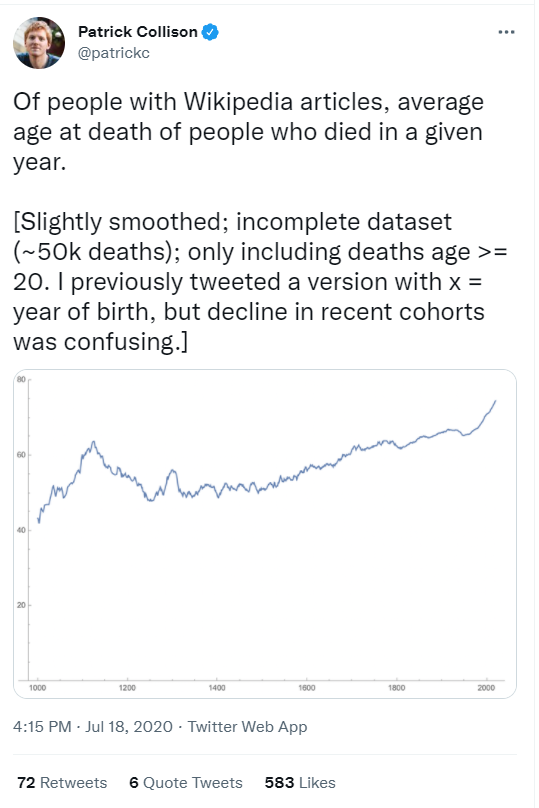

>“There is only one god and his name is death. And there is only one thing we say to death: **Not today**.”
>
>― Syrio Forel (Game of Thrones S1:Ep6: A golden crown)

While Game of Thrones fans are fond of refusing the God of Death, Wikipedia has lots of data about people who did say: Ok, today is the day.


::: {.cell}

:::


# Inspiration

In July 2020, my husband presented me with two tweets about change of the average age of death over time ([tweet 1](https://twitter.com/patrickc/status/1284582707897364480?ref_src=twsrc%5Etfw) and [tweet 2](https://twitter.com/paulg/status/1284578860827324417)) and challenged me to make some cooler graphs. 

{fig-align="center"}

{fig-align="center"}

# Motivations

With this post, I want to do three things: 

- See if I could make more engaging graphs than the original twitter post using R

- Learn to pull data from [Wikidata](https://www.wikidata.org/wiki/Wikidata:Main_Page) using the {WikidataQueryServiceR} package

- Visualize the differences between males and females in the data

I work in healthcare data, so often I cannot share my data or analysis for privacy reasons. This post is my way to share some of the techniques I use at work with data that **CAN** see the light of day.

Here I will walk you start to finish, from data pull to pretty plots, to give you some inspiration for your own data analysis projects.

# Data sources

I originally started working on this analysis and blog post on July 22, 2020, so I have learned a lot of data analytic and programming skills since then, but at the time I had never written a SQL (or one of the many similar SQL-like languages) query outside of an online programming tutorial.

This is the command I used to grab the data from the Wikidata Query Service on November 6, 2021 using the {[WikidataQueryServiceR](https://cran.r-project.org/web/packages/WikidataQueryServiceR/WikidataQueryServiceR.pdf)} package.


::: {.cell}

```{.r .cell-code}
my_wiki_query <- query_wikidata('SELECT ?item ?dob ?dod ?sex_or_gender WHERE {
  ?item wdt:P31 wd:Q5;
  OPTIONAL { ?item wdt:P570 ?dod }
  OPTIONAL { ?item wdt:P569 ?dob }
  OPTIONAL { ?item wdt:P21 ?sex_or_gender. }
}')
```
:::

::: {.cell}

:::


With this short command, I was able to quite effortlessly pull data on 3207218 records. 

As I started out learning R and playing with data, I knew nothing about querying publicly available sources of data. Being able to pull over 3 million rows of data for a toy project is an amazing feat! 

If you are just starting out in learning R or want to find some great pre-cleaned datasets to work with, check out [Tidy Tuesday](https://github.com/rfordatascience/tidytuesday) and follow people's work on twitter using the [#TidyTuesday hashtag](https://twitter.com/hashtag/TidyTuesday?src=hashtag_click). 


::: {.cell}

:::


# Understanding the data

The first question I had about the distribution of data on time and by year. I decided to limit myself to the year 1000 onward to be somewhat comparable to the tweets that inspired this post. Here I created a plot to show the distribution of births counts by birth year. 


::: {.cell}
::: {.cell-output-display}
{width=672}
:::
:::


Some notable things about the data is the increase of number of available records over time and with an expected drop off as the birth year gets closer to the current year. 

I expected a drop off because it takes most people a certain number of years of life to become notable enough to get a Wikipedia page. While I don't do this here, I think it would be an interesting analysis to calculate the average age at which a person receives an entry to Wikipedia. 

A fun sub-analysis would to examine differences in the ages by category of notability. For example, I expect that athletes would have a younger age of first entry compared to Nobel Laureates.

Another notable trend is that the birth count is high at the start of centuries (eg 1100) compared to intervening years with blunting of that phenomenon from 1500 onward and disappearing around 1800. My instinct is that this reflects the improvement in record keeping and preservation as we approach modern times. 

# Sex based differences

My prediction prior to exploring the distribution is that women are represented at lower rates in the data compared to men. Graphing the data confirms this. I suppose the surprising insight from the graph is that the proportion of women represented in the data from about 1500 to 1800 is so consistent.


::: {.cell}
::: {.cell-output-display}
{width=672}
:::
:::

::: {.cell}

:::


# Average age of death 

I considered two ways to visualize the average of death. The first way is by grouping birth year and seeing the average age of death for that group. As you can see in the graph below, the major issue with that approach is that years close to the present will have very low average ages for death. This happens because in years less than roughly 80 years prior to 2021, anyone who has died, died relatively 'young'. 


::: {.cell}
::: {.cell-output-display}
{width=672}
:::

::: {.cell-output-display}
{width=672}
:::
:::


To avoid this problem, I instead grouped by death year to show the average age of death for people who died in that year. From these plots we see the average age of death for women flips to be higher than men in the early 20th century and continues until present time.


::: {.cell}
::: {.cell-output-display}
{width=672}
:::

::: {.cell-output-display}
{width=672}
:::
:::


To compare to tweet 1, I need to exclude deaths that occurred at 20 or under. By examining my plot verses that tweet, it is difficult to compare because I don't know what smoothing function that the person used to calculate their line. The data before about 1600 has much more variability that data after that point. 


::: {.cell}
::: {.cell-output-display}
{width=672}
:::
:::


Given this, I then investigated what the average age of death looks like from 1600 onward. 


::: {.cell}
::: {.cell-output-display}
{width=672}
:::

::: {.cell-output-display}
{width=672}
:::
:::


Finally, let's look at the data from 1800 onward to investigate the huge expected impacts of both World Wars. While I expected to see the huge impact on age of death in the years 1914 - 1918 and 1939 - 1945, I was surprised to see that the average age of death for both men and women was so affected. I anticipated that men, who are the primary actors in military actions, would have taken a bigger hit than women. While beyond the scope of this post, I think there might be something mysterious going on in the data around the turn of the 21st century with a spike upwards in both sex's average age of death.


::: {.cell}
::: {.cell-output-display}
{width=672}
:::

::: {.cell-output-display}
{width=672}
:::
:::


# Dirty data

Speaking of data issues, the final part of my analysis I'd like to share is how many birth dates are represented at higher rates than expected. As mentioned above, before 1800, many people had birth years listed as years like 1000 or 1300. Here I'll also show how uncertainty of the day of births can be seen in the data. 

The plot below shows a yellow dot for date that has a 10% or greater number of birth dates than expected under the (somewhat tenuous) assumption that birth days will be distributed equally throughout the year. Notice the nearly straight lines on the y-axis which represents birth dates that fall on the start of a month. 


::: {.cell}
::: {.cell-output-display}
{width=672}
:::
:::


Difficult to see on the graph above, but here is a zoomed in version looking only at January birth dates. Here you can see that January 1st is over-represented in the data for literally ever year in the data from 1000 to 2021!


::: {.cell}
::: {.cell-output-display}
{width=672}
:::
:::


# Wrap up

I hope you have enjoyed my mini-journey of exploring the average age of the death over time. It only took me 17 months to finally finish it! 

What I hope I can do in future posts is look at data for people beyond those notable enough to have Wikidata entries to see the difference in life expectancies for those more and less notable.

# Technical notes

For anyone wanting to reproduce my work, you can see my raw code below as well as my R session information. If you repeat the analysis, your data will likely be different than mine as the data pull for this post was done on November 6, 2021. 


::: {.cell}

```{.r .cell-code}
library(tidyverse)
library(WikidataQueryServiceR)
library(lubridate)
library(stringr)
library(magrittr)
library(plotly)
library(DT)
library(scales)
library(ggthemes)

my_wiki_query <- query_wikidata('SELECT ?item ?dob ?dod ?sex_or_gender WHERE {
  ?item wdt:P31 wd:Q5;
  OPTIONAL { ?item wdt:P570 ?dod }
  OPTIONAL { ?item wdt:P569 ?dob }
  OPTIONAL { ?item wdt:P21 ?sex_or_gender. }
}')

my_wiki_query <- readRDS("./data/my_wiki_query.rds")

count_query <- nrow(my_wiki_query)

# sex notation
my_wiki_query %<>% 
  mutate(simplified_sex = case_when(
    sex_or_gender == "http://www.wikidata.org/entity/Q6581072" ~ 1, #female
    sex_or_gender == "http://www.wikidata.org/entity/Q6581097" ~ 2, #male
    TRUE ~ 3 #not female, not male
    ))

my_wiki_query %<>% 
  dplyr::distinct(item, .keep_all= TRUE) %>% 
  dplyr::mutate(full_year_of_birth = str_extract(dob, "-?[:digit:]{4}")) %>% 
  dplyr::mutate(full_year_of_death = str_extract(dod, "-?[:digit:]{4}")) %>% 
  dplyr::mutate(approx_age_at_death = as.numeric(full_year_of_death) - as.numeric(full_year_of_birth)) 

my_wiki_query$full_year_of_birth <- as.numeric(my_wiki_query$full_year_of_birth) 
my_wiki_query$full_year_of_death <- as.numeric(my_wiki_query$full_year_of_death)   
my_wiki_query$simplified_sex <- as_factor(my_wiki_query$simplified_sex)

my_wiki_query %<>% mutate(decade_birth = full_year_of_birth %/% 10)
my_wiki_query %>% 
  filter(full_year_of_birth >= 1000 & full_year_of_birth < 2022) %>% 
  filter(simplified_sex == 1 | simplified_sex == 2) %>% 
  ggplot(aes(x = full_year_of_birth)) +
  geom_histogram(binwidth = 10) +
  scale_y_log10(breaks=c(100, 1000, 10000, 100000), labels = c("100", "1000", "10,000", "100,000")) +
  scale_x_continuous(breaks = seq(1000, 2021, 100)) +
  theme_economist() + 
  labs(title = "Distribution of births per year",
       x = "Year",
       y = "Birth count per year",
       subtitle = "Years 1000 to 2021\nLog Scale Y-axis", 
       caption = "Including only records with birth years,\nand restricted to sex of either male or female.") +
  coord_cartesian(ylim = c(100, 200000))
male_color <- "#2E45B8"
female_color <- "#C91D42"

sex_proportion_plot <- my_wiki_query %>% 
  filter(simplified_sex == 1 | simplified_sex == 2) %>% 
  filter(full_year_of_birth >= 1000 & full_year_of_birth < 2021) %>% 
#  group_by(decade_birth) %>% 
  ggplot(aes(x = full_year_of_birth, fill = simplified_sex, color = simplified_sex)) +
  geom_bar(position = "fill") +
  scale_fill_manual(labels = c("Female", "Male"), values = c(female_color, male_color)) +
  scale_color_manual(labels = c("Female", "Male"), values = c(female_color, male_color)) +
  labs(title = "Proportion of men and women over time in birth cohorts", 
       x = "Year of birth",
       y = " ", 
       fill = "Sex", 
       color = NULL) +
  geom_hline(yintercept = 0.5) +
  theme_economist() +
  scale_y_continuous(breaks=c(0, 0.25, .5, 0.75, 1), 
                     labels = c(" ", " ", "50%", " ", " ")) +
  scale_x_continuous(breaks = seq(1000, 2021, 100)) +
  guides(color = "none")

sex_proportion_plot
ce_dates <- my_wiki_query %>% 
  filter(full_year_of_birth >= 1000 & full_year_of_birth <= 2021) %>% 
  filter(full_year_of_death >= 1000 & full_year_of_birth <= 2021) %>% 
  mutate(date_of_birth = as_date(dob)) %>%
  mutate(year_birth = year(date_of_birth)) %>%
  mutate(month_birth = month(date_of_birth)) %>%
  mutate(day_birth = day(date_of_birth)) %>%
  mutate(date_of_death = as_date(dod)) %>%
  mutate(year_death = year(date_of_death)) %>%
  mutate(month_death = month(date_of_death)) %>%
  mutate(day_death = day(date_of_death)) %>%
  mutate(lifespan = as.duration(interval(date_of_birth, date_of_death))) %>% 
  filter(lifespan < years(123)) %>% 
  filter(lifespan >= years(0))
average_lifespan_by_sex <- ce_dates %>% 
  group_by(year_birth, simplified_sex) %>% 
  summarise(average_age = mean((lifespan)))

average_lifespan <- ce_dates %>% 
  group_by(year_birth) %>% 
  summarise(average_age = mean((lifespan)))

plot_average_lifespan <- average_lifespan %>%  
  ggplot(aes(x = year_birth, y = (average_age/31557600))) +
  geom_smooth(color = 	"#F97A1F") +
  geom_point(alpha = 0.05, color = 	"#F97A1F") +
  labs(title = "Average age of death over time",
       x = "Birth Year Cohort",
       y = "Age") 

plot_average_lifespan + theme_economist() + scale_x_continuous(breaks = seq(1000, 2021, 100))

average_lifespan_by_sex <- ce_dates %>% 
  group_by(year_birth, simplified_sex) %>% 
  summarise(average_age = mean((lifespan)))

plot_average_lifespan_by_sex <- average_lifespan_by_sex %>% 
  filter(simplified_sex != 3) %>% 
  ggplot(aes(x = year_birth, y = (average_age/31557600), color = simplified_sex)) +
  geom_smooth() +
  geom_point(alpha = 0.05) +
  scale_color_manual(labels = c("Female", "Male"), values = c(female_color, male_color)) +
  labs(title = "Average age of death over time by sex",
       x = "Birth Year Cohort",
       y = "Age", 
       color = "Sex") 

plot_average_lifespan_by_sex + theme_economist() + scale_x_continuous(breaks = seq(1000, 2021, 100)) 
average_lifespan_by_sex_dc <- ce_dates %>% 
  group_by(year_death, simplified_sex) %>% 
  summarise(average_age = mean((lifespan)))

average_lifespan_dc <- ce_dates %>% 
  group_by(year_death) %>% 
  summarise(average_age = mean((lifespan)))

plot_average_lifespan_dc <- average_lifespan_dc %>%  
  ggplot(aes(x = year_death, y = (average_age/31557600))) +
  geom_smooth(color = 	"#F97A1F") +
  geom_point(alpha = 0.05, color = 	"#F97A1F") +
  labs(title = "Average age of death over time",
       x = "Death Year Cohort",
       y = "Age") 

plot_average_lifespan_dc  + theme_economist() + scale_x_continuous(breaks = seq(1000, 2021, 100))

plot_average_lifespan_by_sex_dc <- average_lifespan_by_sex_dc %>% 
  filter(simplified_sex != 3) %>% 
  ggplot(aes(x = year_death, y = (average_age/31557600), color = simplified_sex)) +
  geom_smooth() +
  geom_point(alpha = 0.05) +
  scale_color_manual(labels = c("Female", "Male"), values = c(female_color, male_color)) +
  labs(title = "Average age of death over time by sex",
       x = "Death Year Cohort",
       y = "Age", 
       color = "Sex") 

plot_average_lifespan_by_sex_dc + theme_economist() + scale_x_continuous(breaks = seq(1000, 2021, 100))
average_lifespan_dc_20 <- ce_dates %>% 
  filter(lifespan > 630720000) %>% 
  group_by(year_death) %>% 
  summarise(average_age = mean((lifespan)))

plot_average_lifespan_dc_20 <- average_lifespan_dc_20  %>%  
  ggplot(aes(x = year_death, y = (average_age/31557600))) +
  geom_smooth(color = 	"#F97A1F") +
  geom_point(alpha = 0.05, color = 	"#F97A1F") +
  labs(title = "Average age of death over time",
       subtitle = "Only lifespans greater than 20 years",
       x = "Death Year Cohort",
       y = "Age") 

plot_average_lifespan_dc_20 + theme_economist() + scale_x_continuous(breaks = seq(1000, 2021, 100))
plot_average_lifespan_dc <- average_lifespan_dc %>%  
  filter(year_death >= 1600) %>% 
  ggplot(aes(x = year_death, y = (average_age/31557600))) +
  geom_smooth(color = 	"#F97A1F") +
  geom_point(alpha = 0.05, color = 	"#F97A1F") +
  labs(title = "Average age of death over time",
       x = "Death Year Cohort",
       y = "Age") 

plot_average_lifespan_dc + 
  theme_economist() + 
  scale_x_continuous(breaks = seq(1000, 2021, 100)) + 
    coord_cartesian(ylim = c(40, 90))

plot_average_lifespan_by_sex_dc <- average_lifespan_by_sex_dc %>% 
  filter(year_death >= 1600) %>% 
  filter(simplified_sex != 3) %>% 
  ggplot(aes(x = year_death, y = (average_age/31557600), color = simplified_sex)) +
  geom_smooth() +
  geom_point(alpha = 0.05) +
  scale_color_manual(labels = c("Female", "Male"), values = c(female_color, male_color)) +
  labs(title = "Average age of death over time",
       x = "Death Year Cohort",
       y = "Age", 
       color = "Sex") +
  guides(color = "none")

plot_average_lifespan_by_sex_dc + 
  theme_economist() + 
  scale_x_continuous(breaks = seq(1000, 2021, 100)) + 
  coord_cartesian(ylim = c(40, 90))
year_cutoff <- 1800

plot_average_lifespan_dc <- average_lifespan_dc %>%  
  filter(year_death >= year_cutoff) %>% 
  ggplot(aes(x = year_death, y = (average_age/31557600))) +
  geom_line(color = 	"#F97A1F") +
 # geom_point(alpha = 0.05, color = 	"#F97A1F") +
  labs(title = "Average age of death over time",
       x = "Death Year Cohort",
       y = "Age") 

plot_average_lifespan_dc + 
  theme_economist() + 
  scale_x_continuous(breaks = seq(1000, 2021, 100)) + 
    coord_cartesian(ylim = c(40, 90))

plot_average_lifespan_by_sex_dc <- average_lifespan_by_sex_dc %>% 
  filter(year_death >= year_cutoff) %>% 
  filter(simplified_sex != 3) %>% 
  ggplot(aes(x = year_death, y = (average_age/31557600), color = simplified_sex)) +
  geom_line() +
  scale_color_manual(labels = c("Female", "Male"), values = c(female_color, male_color)) +
  labs(title = "Average age of death over time by sex",
       x = "Death Year Cohort",
       y = "Age", 
       color = "Sex") +
  guides(color = "none")

plot_average_lifespan_by_sex_dc + 
  theme_economist() + 
  scale_x_continuous(breaks = seq(1000, 2021, 100)) + 
  coord_cartesian(ylim = c(40, 90))
heatmap_dates <- ce_dates %>% 
  mutate(pad_month_birth = str_pad(month_birth, width = 2, side = "left", pad = 0)) %>% 
  mutate(pad_day_birth = str_pad(day_birth, width = 2, side = "left", pad = 0)) %>% 
  unite("heatdate", c(year_birth, pad_month_birth, pad_day_birth), sep = "-", remove = FALSE) %>% 
  mutate(doy = lubridate::yday(as_date(heatdate)))

heatmap_dates_subset <- heatmap_dates %>% dplyr::select(year_birth, heatdate, doy)

heatmap_data <- heatmap_dates_subset %>% 
  group_by(year_birth, doy) %>% 
  summarise(count = n()) %>% 
  ungroup() %>% 
  group_by(year_birth) %>% 
  mutate(year_total = sum(count)) %>% 
  mutate(proportion_year = count/year_total) %>% 
  mutate(too_high = case_when(
    proportion_year > 0.003 ~ 1, #roughly 10% higher than expected
    TRUE ~ 0
  ))


too_many_births_plot <- heatmap_data  %>% 
  filter(year_birth >= 1500) %>% 
  ggplot(aes(x = year_birth, y = doy, fill = too_high, text = )) + 
  geom_tile() +
  scale_fill_gradient(low = "#475ED1", high = "#F9C31F") + # mid 
  theme_economist() +
  theme(legend.position = "none") +
  labs(x = "Year", 
       y = " ", 
       title = "Days of the year with more than expected birthdates",
       subtitle = "Yellow represents with \"too\" many births \nY-axis is the day of the year with tick marks to show the start of the month") +
  scale_y_continuous(breaks=c(1, 32, 60, 91, 121, 152, 182, 213, 244, 274, 305, 335),
                     labels = c("J", "F", "M", "A", "M", "J", "J", "A", "S", "O", "N", "D"))

too_many_births_plot
too_many_births_plot <- heatmap_data  %>% 
  filter(doy < 31) %>% 
  ggplot(aes(x = year_birth, y = doy, fill = too_high, text = )) + 
  geom_tile() +
  scale_fill_gradient(low = "#475ED1", high = "#F9C31F") + # mid 
  theme_economist() +
  theme(legend.position = "none") +
  labs(x = "Year", 
       y = " ", 
       title = "Days of the year with more than expected birthdates",
       subtitle = "Yellow represents with \"too\" many births \nY-axis is the day of the year with tick marks to show the start of the month") +
  scale_y_continuous(breaks=c(1, 32, 60, 91, 121, 152, 182, 213, 244, 274, 305, 335),
                     labels = c("J", "F", "M", "A", "M", "J", "J", "A", "S", "O", "N", "D"))

too_many_births_plot

sessionInfo()
```
:::

::: {.cell}

```{.r .cell-code}
sessionInfo()
```

::: {.cell-output .cell-output-stdout}
```
R version 4.2.1 (2022-06-23 ucrt)
Platform: x86_64-w64-mingw32/x64 (64-bit)
Running under: Windows 10 x64 (build 22621)

Matrix products: default

locale:
[1] LC_COLLATE=English_United States.utf8 
[2] LC_CTYPE=English_United States.utf8   
[3] LC_MONETARY=English_United States.utf8
[4] LC_NUMERIC=C                          
[5] LC_TIME=English_United States.utf8    

attached base packages:
[1] stats     graphics  grDevices utils     datasets  methods   base     

other attached packages:
 [1] ggthemes_4.2.4              scales_1.2.1               
 [3] DT_0.27                     plotly_4.10.1              
 [5] magrittr_2.0.3              WikidataQueryServiceR_1.0.0
 [7] lubridate_1.9.2             forcats_1.0.0              
 [9] stringr_1.5.0               dplyr_1.1.0                
[11] purrr_1.0.1                 readr_2.1.4                
[13] tidyr_1.3.0                 tibble_3.1.8               
[15] ggplot2_3.4.1               tidyverse_2.0.0            

loaded via a namespace (and not attached):
 [1] tidyselect_1.2.0  xfun_0.37         lattice_0.20-45   splines_4.2.1    
 [5] colorspace_2.1-0  vctrs_0.5.2       generics_0.1.3    htmltools_0.5.4  
 [9] viridisLite_0.4.1 yaml_2.3.7        mgcv_1.8-40       utf8_1.2.3       
[13] rlang_1.0.6       pillar_1.8.1      glue_1.6.2        withr_2.5.0      
[17] lifecycle_1.0.3   munsell_0.5.0     gtable_0.3.1      htmlwidgets_1.6.1
[21] evaluate_0.20     labeling_0.4.2    knitr_1.42        tzdb_0.3.0       
[25] fastmap_1.1.0     fansi_1.0.4       jsonlite_1.8.4    farver_2.1.1     
[29] hms_1.1.2         digest_0.6.29     stringi_1.7.8     grid_4.2.1       
[33] cli_3.6.0         tools_4.2.1       lazyeval_0.2.2    pkgconfig_2.0.3  
[37] Matrix_1.4-1      ellipsis_0.3.2    data.table_1.14.8 timechange_0.2.0 
[41] assertthat_0.2.1  rmarkdown_2.20    httr_1.4.5        rstudioapi_0.14  
[45] ratelimitr_0.4.1  R6_2.5.1          nlme_3.1-157      compiler_4.2.1   
```
:::
:::

